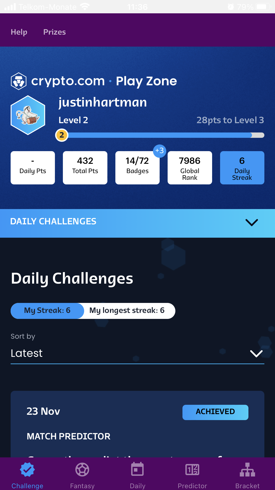
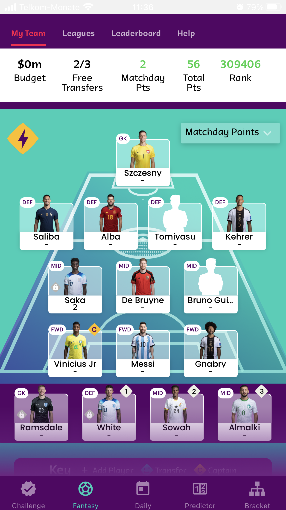
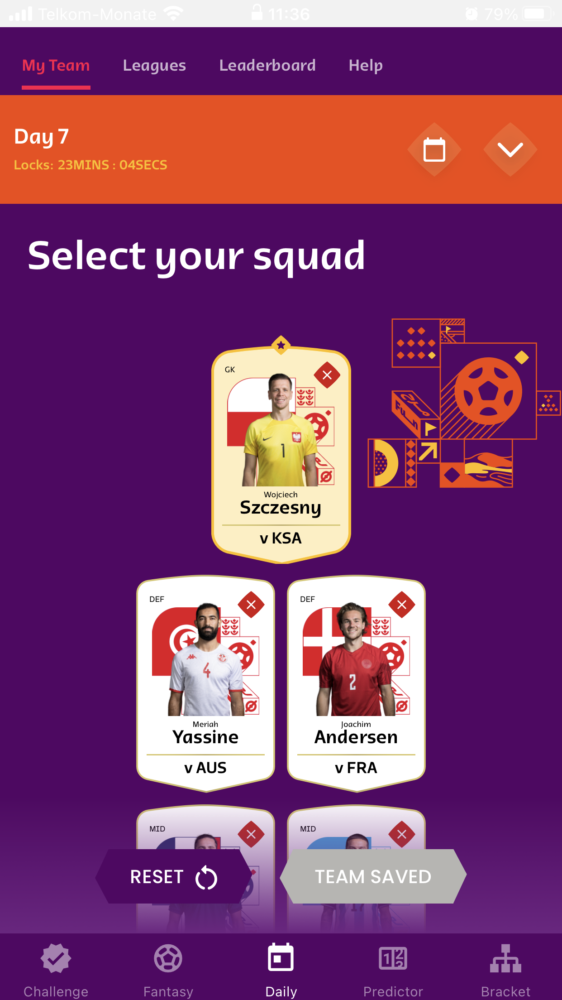
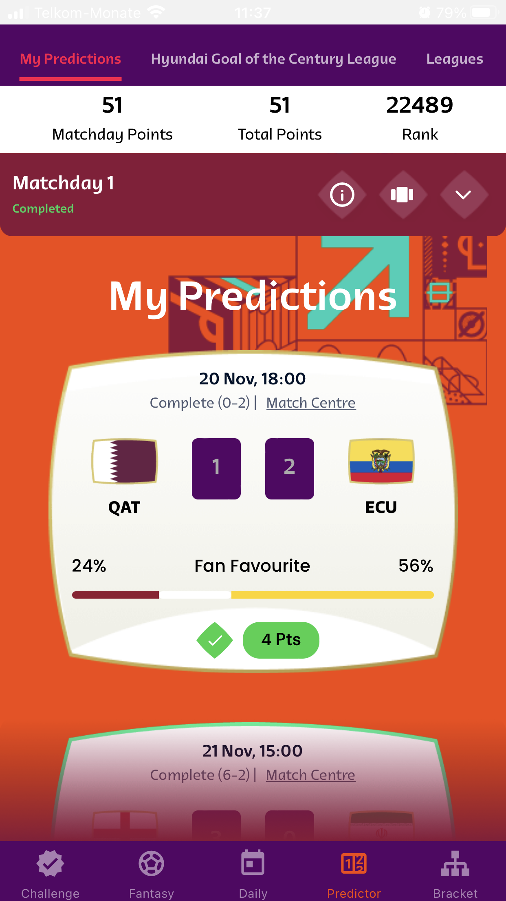
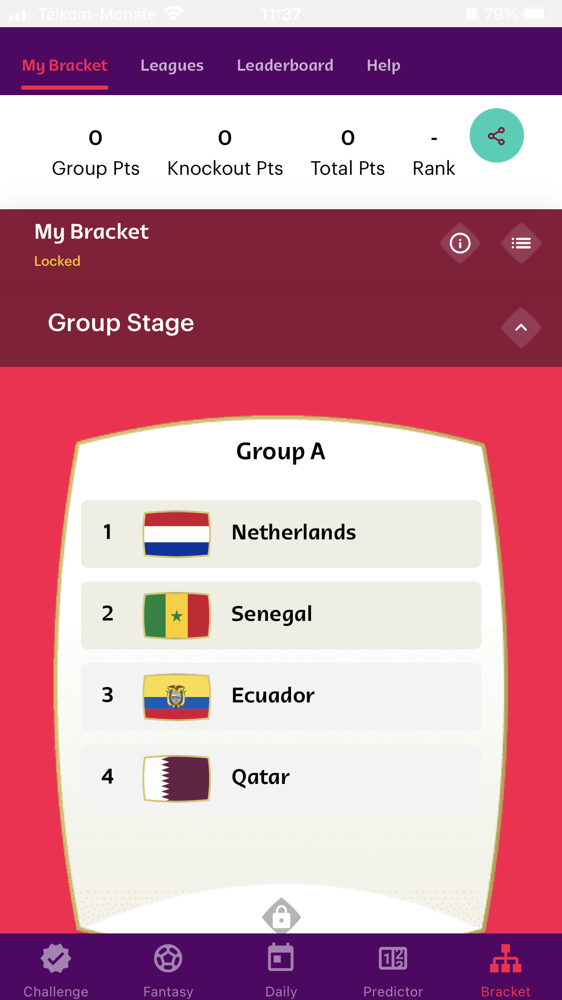

# FIFA+ Play Zone - World Cup 2022 in Qatar

This repo features an Expo React Native app that consolidates FIFA+ Play Zone for the World Cup 2022 in Qatar. There is a FIFA+ app in the respective app stores however navigating to the specifics of the Play Zone is cumbersome and confusing. This app contains tabs for each of the main Play Zone sections of the FIFA site, namely:

- Daily Challenge
- Fantasy League
- Daily Fantasy
- Match Predictor
- Player of the Match
- Who Am I?
- Bracket Predictor

## License

> This project is licensed under an [MIT License](https://justinhartman.mit-license.org/). Copyright © 2022 Justin Hartman, https://justinhartman.co <code@justhart.com>
